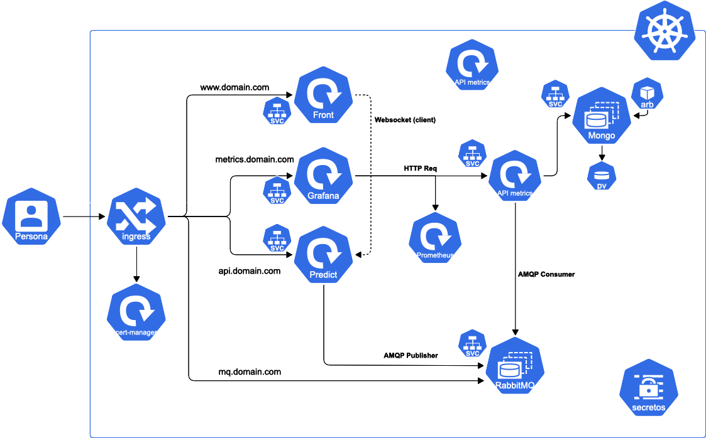

# Building roof detection

## Requirements
To deploy this project in your local machine, you need to install Python and Node.js dependencies:
- Go to `./api` folder and run `pip install -r requirements.txt`. You can also create a virtual environment before running this command.
- In the project root, run `npm i` to install Node.js libraries.

This project has been tested with Python 3.8+ and Node.js 14.18

## How to run in a local machine
This project consists on multiple services, as shown in the picture below.

To run in development mode you have to deploy each service individually:
- **MongoDB**: Download from their website or use their official Docker image. It should use the dafault port, or change the connection uri in `./common/config/local.env`
- **RabbitMQ**: Download from their website or use their official Docker image. It should use the dafault port, or change the connection uri in `./common/config/local.env` and `./api/helpers/publisher.py`
- **Grafana**: use their official Docker image.
- **Predictions API**: run the `./api/app.py` file with Python
- **Metrics API**: run `npm run devMetrics` in the root folder
- **Front server**: run `npm run devFront` in the root folder

## How to deploy on GCP cluster
- Get a regional IP address
- Create a GKE cluster
- Download credentials for GKE cluster (limited permissions)
- Setup DNS
- Setup Github secrets: GKE_EMAIL, GKE_KEY, GKE_PROJECT
- Change IP in deploy/ingress/nginx-ingress.yaml loadBalancerIP, or any IP you added in config files
- Update development and production configurations
- (Optional, for development env) Setup test database
- Create certificates and ingress and apply files (or use CI/CD with Github Actions)
